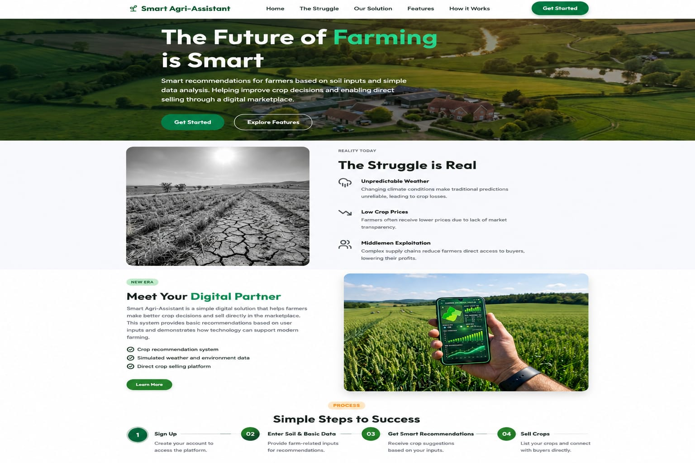
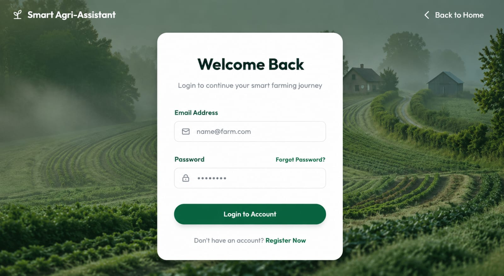
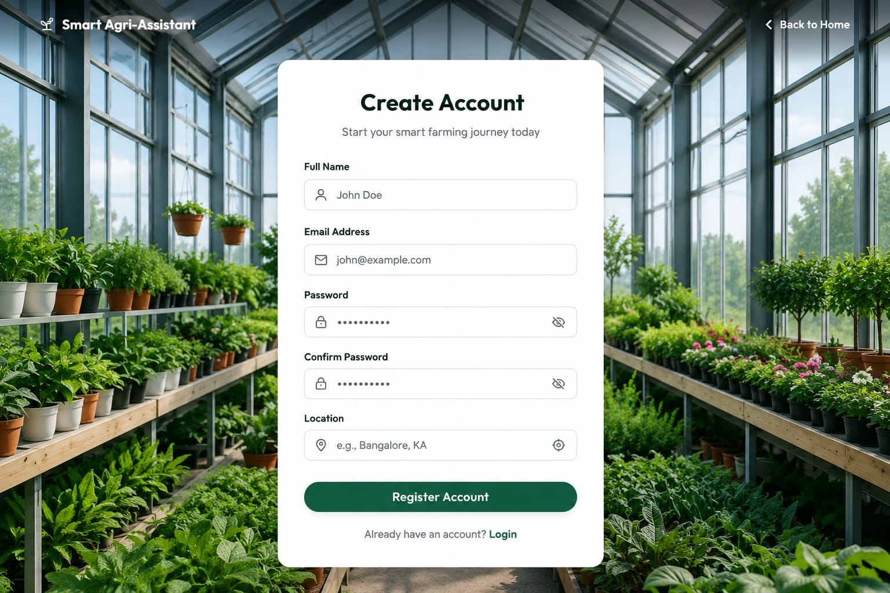
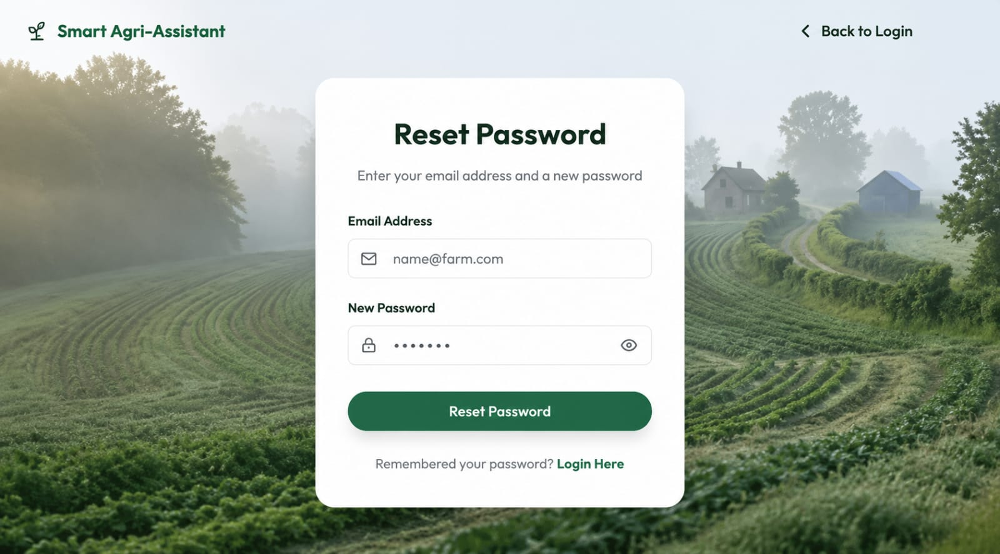
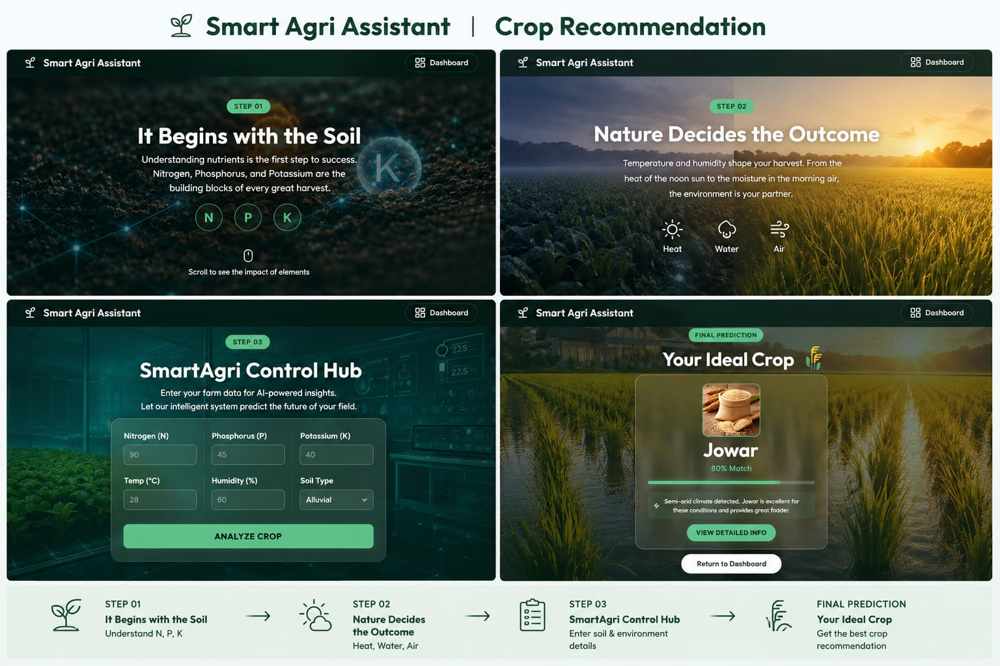
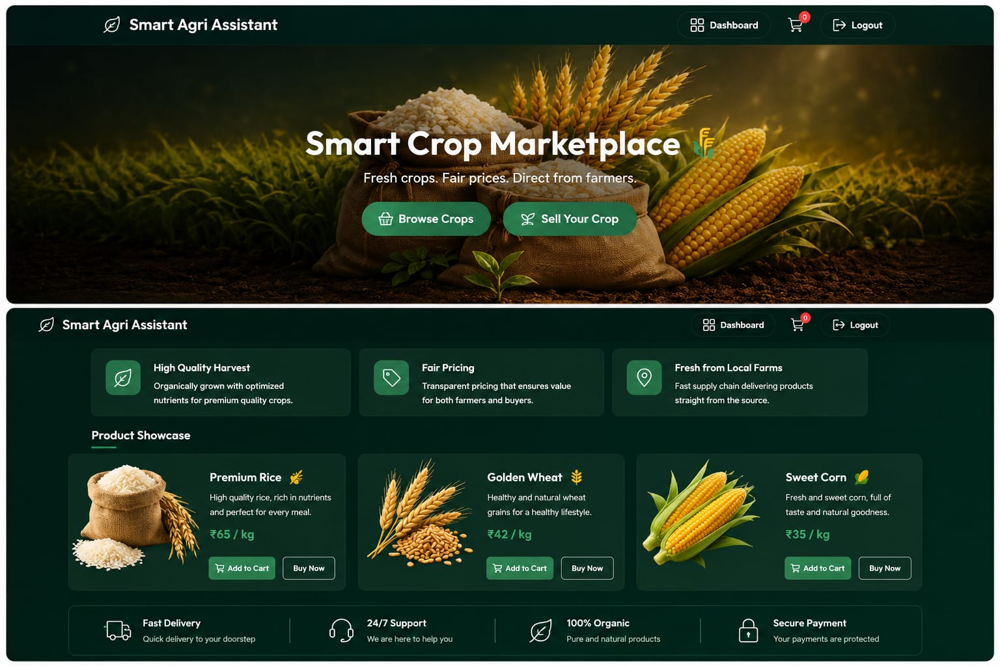
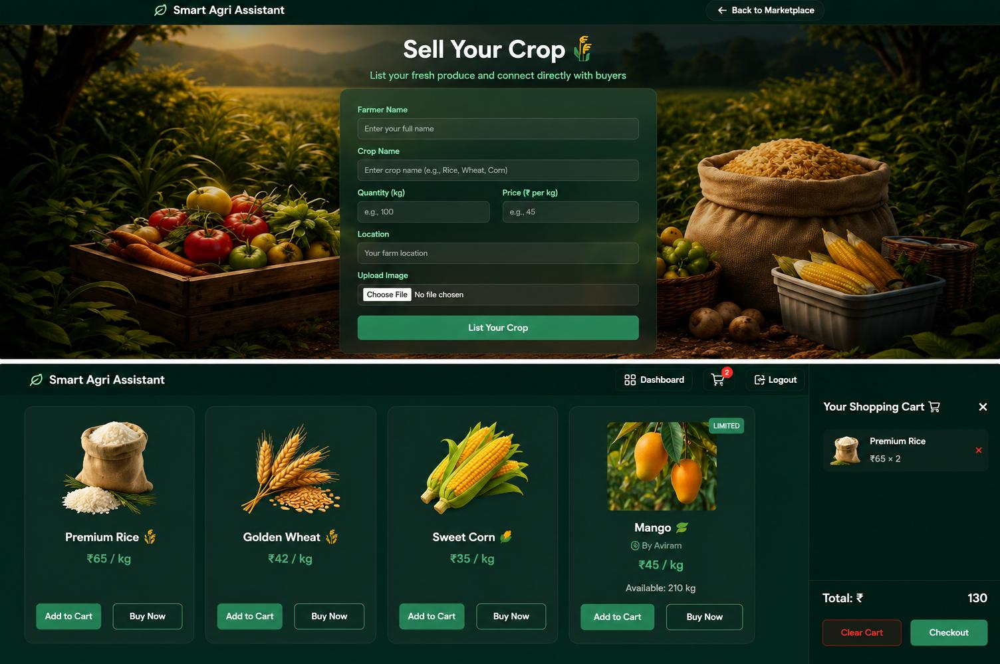

# Smart Agri-Assistant 🌱

## 1. Project Overview
**Smart Agri-Assistant** is a comprehensive, modern digital platform designed to bridge the gap between traditional farming practices and modern technology. The project aims to empower farmers by providing data-driven insights for crop selection, real-time weather information, and a direct digital marketplace to sell their produce.

## 2. Abstract
Agriculture remains the backbone of our economy, yet many farmers struggle with unpredictable weather patterns, unsuitable crop choices, and lack of direct market access. This project provides a "Smart" solution—an integrated web application that uses environmental data (Nitrogen, Phosphorus, Potassium, Temperature, and Humidity) to recommend the best crops for a specific land area. Additionally, it features a marketplace module that removes middlemen, allowing farmers to list products and interact with buyers directly.

## 3. 📸 Project Screenshots

### 🏠 Home Page


### 🔐 Login Page


### 📝 Register Page


### 🔑 Forgot Password


### 🌱 Crop Recommendation


### 🛒 Marketplace


### 🌾 Sell Crop & Cart

## 4. Core Modules & Functionalities

### 🌾 Intelligent Crop Recommendation
*   **Rule-based Analysis**: Analyzes soil nutrients (NPK) and climate data (Temperature, Humidity) to suggest the most suitable crop (Rice, Wheat, Corn, etc.).
*   **Detailed Crop Insights**: Provides deep dives into specific crops, covering soil requirements, watering needs, and harvesting tips.

### 🛒 Farmers' Marketplace
*   **Sell Portal**: Farmers can list their crops with images and prices.
*   **Direct-to-Consumer**: A marketplace where buyers can browse available produce, fostering a fair price ecosystem.

### 🌤️ Weather Intelligence
*   **Real-time Updates**: Integrated weather data to help farmers plan their irrigation and harvesting schedules effectively.

### 👤 User Management & Dashboard
*   **Personalized Experience**: Secure login/registration system with a dedicated dashboard to track listed products and saved recommendations.
*   **Secure Authentication**: Backend-verified login and password reset functionalities.

## 5. Technical Architecture

### Frontend (User Interface)
*   **HTML5 & CSS3**: Utilizes a modern "Neo-Brutalism" and professional aesthetic for high readability and engagement.
*   **Vanilla JavaScript**: Handles all client-side logic, dynamic UI updates, and rule-based recommendation algorithms.
*   **AOS (Animate On Scroll)**: For smooth, premium transitions and micro-animations.

### Backend (Server Side)
*   **Python (Flask)**: A lightweight web framework managing API requests, user authentication, and data persistence.
*   **JSON-based Storage**: Currently uses a structured JSON system for managing user profiles and market listings, ensuring simplicity and speed.

## 6. How to Run Locally

### Prerequisites
- Python 3.x installed
- Browser (Chrome, Edge, Firefox, etc.)

### Installation Steps
1. Clone the repository:
   ```bash
   git clone <your-repository-url>
   ```
2. Navigate to the project directory:
   ```bash
   cd Bca_project
   ```
3. Install backend dependencies (e.g. Flask):
   ```bash
   pip install Flask
   ```
4. Run the Flask backend (adjust filename if necessary):
   ```bash
   cd Backend
   python app.py 
   ```
5. Open your browser and go to `http://127.0.0.1:5000` (or whichever port Flask is running on).

## 7. Future Scope & Roadmap
- **Machine Learning Integration**: Transitioning to a trained ML model (Random Forest or XGBoost) for higher prediction accuracy.
- **IoT & Sensor Integration**: Connecting with real-time soil sensors to automatically fetch NPK levels.
- **Voice-Activated AI Assistant**: Multilingual voice support for accessibility.
- **E-commerce & Payments**: Integration of secure payment gateways.
- **Agricultural Hub**: Government schemes, loans, and crop insurance applications.
- **Logistics Integration**: Partnering with delivery services to automate transport.

---
*Developed as a BCA Project.*
